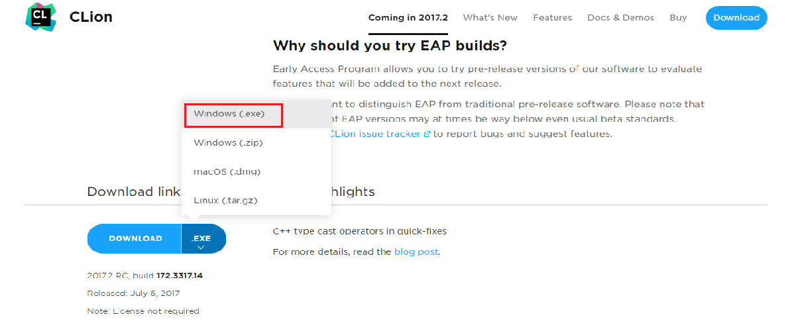
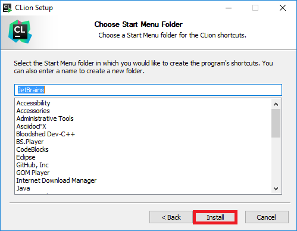
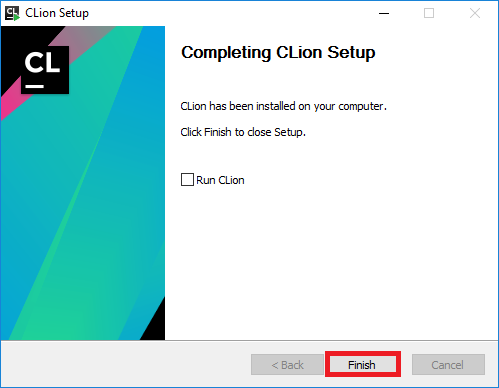

= CLion Kurulumu
Windows ve Linux işletim sisteminde CLion-2017.2 IDE kurulumu anlatılmaktadır.

= WINDOWS

CLion kurulumundan önce C++ 17 destekli bir derleyicinin kurulumu yapılmalıdır. GNU GCC 7.1 C++ 17’yi desteklemektedir.

== MinGW ile GNU GCC 7.1 Kurulumu
C++ 17 destekli derleyici kurulumu için https://sourceforge.net/projects/mingw-w64/files/Toolchains%20targetting%20Win32/Personal%20Builds/mingw-builds/installer/[buradan] “mingw-w64-install.exe” adlı dosyayı indiriniz.

.MinGW Kurulum Kurulum Adım 1
image::Resim/mingwkurulum1.png[]

.MinGW Kurulum Kurulum Adım 2
image::Resim/mingwkurulum2.png[]
7.1.0 sürümü olmasına dikkat edin.

.MinGW Kurulum Kurulum Adım 3
image::Resim/mingwkurulum3.png[]

.MinGW Kurulum Kurulum Adım 4
image::Resim/mingwkurulum4.png[]

.MinGW Kurulum Kurulum Adım 5
image::Resim/mingwkurulum5.png[]

Derleyicinin yüklenmesi tamamlandı. Şimdi C++ 17 destekli tümleşik geliştirme ortamı (IDE) yükleyiniz.

== CLion-2017.2

Güncel CLion IDE’sini https://www.jetbrains.com/clion/nextversion/[buradan] indirebilir ve IDE’nin kurulumunu aşağıdaki yönergeleri takip ederek yapabilirsiniz.

.Clion'ın sitesi

Yukarıda belirtilen linkte resim 6'daki kısım ile bilgisayarınıza uygun kurulum yapınız.
Kurulum için aşağıdaki adımları takip ediniz.

.CLion Kurulum Adım 1
image::Resim/clionkurulum1.PNG[]

.CLion Kurulum Adım 2
image::Resim/clionkurulum2.PNG[]

.CLion Kurulum Adım 3
image::Resim/clionkurulum3.PNG[]

.CLion Kurulum Adım 4

.CLion Kurulum Adım 5

.CLion Kurulum Adım 6
image::Resim/clionkurulum6.PNG[]

.CLion Kurulum Adım 7
image::Resim/clionkurulum7.PNG[]

.CLion Kurulum Adım 8
image::Resim/clionkurulum8.PNG[]

.CLion Kurulum Adım 9
image::Resim/clionkurulum9.PNG[]

= LINUX

CLion kurulumundan önce C++ 17 destekli bir derleyicinin kurulumu yapılmalıdır.

== GCC 7.1 Derleyicisi Kurma

Linux işletim sisteminde; Terminal’i açarak aşağıdaki kodları ekleyiniz.

[source,c++]
----
sudo add-apt-repository ppa:jonathonf/gcc-7.1
sudo apt-get update
sudo apt-get install gcc-7 g++-7

----

GCC-7.1 derleyicisi bu işlemler sonunda kurulacaktır.

== CLion-2017.2

Güncel CLion IDE’sini https://www.jetbrains.com/clion/nextversion/[buradan] indirebilir ve IDE’nin kurulumunu aşağıdaki yönergeleri takip ederek yapabilirsiniz.

.Clion'ın sitesi
image::Resim/ubuntuclionsite.png[]

Yukarıda belirtilen linkte resim 16’daki kısım ile bilgisayarınıza uygun indirmeyi yapın ve dosyayı uygun klasörünüze çıkartın.

clion-2017.2→ bin adımlarını takip edin. Daha sonra bulunan klasörde terminali açın.

[source, c++]
----
C++./clion.sh

----

Yukarıdaki komutu terminalde çalıştırın.

.Clion Ubuntu Kurulumu Adım 1
image::Resim/ubuntuclion1.PNG[]

.Clion Ubuntu Kurulumu Adım 2
image::Resim/ubuntuclion1.PNG[]

.Clion Ubuntu Kurulumu Adım 3
image::Resim/ubuntuclion1.PNG[]

.Clion Ubuntu Kurulumu Adım 4
image::Resim/ubuntuclion1.PNG[]

.Clion Ubuntu Kurulumu Adım 5
image::Resim/ubuntuclion1.PNG[]

.Clion Ubuntu Kurulumu Adım 6
image::Resim/ubuntuclion1.PNG[]

.Clion Ubuntu Kurulumu Adım 7
image::Resim/ubuntuclion1.PNG[]

.Clion İlk Proje Açma
image::Resim/ubuntuclion1.PNG[]

= Olası Hatalar
Eğer kurulum sırasında hata oluşmuş ve C++ 17 kodu derlenemiyorsa aşağıdaki hatalardan biri olup olmadığını kontrol ediniz.

== CLion

* "MinGW not found" hatası

.MinGW Bulunamama Hatası Düzeltme 1
image::Resim/hata1.png[]

File->Settings

.MinGW Bulunamama Hatası Düzeltme 2
image::Resim/hata2.png[]

Build,Execution, Deployment->Toolchains->MinGW Home kısmındaki yolun doğru olması gerekmektedir. 4. adım ile gösterilen yerde hata olmadığı belirtildiğinde tamama tıklandıktan sonra sorun giderilmiş olur.
 
* Clion 2017 C++ 17 seçeneğinin bulunmaması

1) https://www.jetbrains.com/clion/nextversion/[Bu siteden] indirdiğinize emin olunuz.

2) "MinGW not found" hatasındaki adımlar uygulanmalıdır. "MinGW bulunamama hatası düzeltme 2" resminin 3 numaralı adımı MinGW'nin 7.1 olduğu yolun doğru olması gerekmektedir.