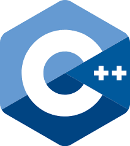

= Bilgisayarlı Görü ve Görüntü İşleme için Modern C ++
:TOC:

== 1. ÖZET

Linux ortamında modern C++ ile yazılım geliştirme, çekirdek yazılım geliştirme teknikleri, OpenCV kullanarak görüntülerle nasıl çalışılır, ters görüntü arama nasıl yapılır gibi soruların uygulamaları ve konu anlatımı bu modern cpp serisinde mevcuttur.

== 2. GİRİŞ

=== 2.1 Neden C++? Neden Linux?

Bilgisayar programcılığı ile ilgili kullanıcı odaklı soru cevap sitesi olan Stack Overflow'un 2018 yılında 50.000'den fazla geliştirici ile yapmış olduğu anket sonuçlarına göre geliştiricilerin neredeyse yarısının (%48.3) Linux kullandığını tespit etmiştir. https://insights.stackoverflow.com/survey/2018/[Anketin detayları...]

Yazılım geliştirme ve proje yönetimi ile ilgili araçlar geliştiren bir yazılım şirketi olan, JetBrainsin yapmış olduğu anketler sistem dili olarak C++ ın en çok tercih edilen dillerden olduğunu ve C++ alanında uzman kişi sayısının az olduğu tespit edilmişdir.
(2015 yılında 4.5 milyon kullanıcı)
https://blog.jetbrains.com/clion/2015/07/infographics-cpp-facts-before-clion/[Anketin detayları...]

=== 2.2 Linux Nedir?

Linux; bilgisayar işletim sistemlerinin en temel parçası olan çekirdek yazılımlarından bir tanesidir. GNU Genel Kamu Lisansı ile sunulan ve Linux Vakfı çatısı altında geliştirilen bir özgür yazılım projesidir. Linux ismi ilk geliştiricisi olan Linus Torvalds tarafından 1991 yılında verilmiştir.GNU/Linux, açık kaynak kodlu bir işletim sistemi çekirdeğidir.

.Linux dizin ağacı görünümü
image::linux.png[]

Terminali açmak için Ctrl + Alt + T tuşuna basın.Linux terminali çok güçlü bir araçtır, coğu görev terminalde GUI'den daha hızlı yapılabilir.Terminal her zaman bir klasördedir.

pwd: **p**rint **w**orking **d**irectory

cd <dir> : **c**hange **d**irectory to <dir>

ls <dir> : **l**i**s**t contents of a directory

*Özel klasörler:*

/ - kök klasör
~ - home(ev) klasör
. - geçerli klasör
.. - üst klasör

=== 2.2.1. Yazılımın Kurulması

Coğu yazılım sistem deposunda bulunur. Ubuntu'da bir program yüklemek için terminale aşağıdaki komutları yazın:

Mevcut paketler hakkındaki bilgileri güncellemek için: *sudo apt update*

İstediğiniz programı kurmak için: *sudo apt install <programın_adı>*

Herhangi bir kütüphane içinde aynı işlemler geçerlidir, sadece *lib* ön eki alırlar.

== 2.3 C++ Kod Nereye Yazılır

Burada iki seçenek vardır: 

1. C ++ IDE 

* CLion 

* Qt Creator 

* Eclipse 

kullanın.

2. Modern bir metin editörü kullanın 

* Sublime Text 3 

* Visual Studio Code 

* Atom 

* VIM

* Emacs 

== Hello World!

Yazdırılan basit C ++ programı:Hello Word!

[source,C++]
----
1 #include <iostream >
2
3 int main() {
4
5 std::cout << "Hello World!" << std::endl;
6 return 0;
7 }
----

=== 2.3.1. Yorum satırları ve Boşluklar Gözardı Edilir:

[source,C++]
----
#include <iostream>

/*Kod icerisinde bulunan Yorumlar ve bosluk karakterleri tamamen yok sayılır*/

1 int main() {return 0;} //Yorum satırı

1 int main()
2
3 { return 0;
4 }

1 int main() {
2     return /* Yorum satırı */ 0;
3    }
----

=== 2.3.2. Kod Stilinin İyi Olması Önemlidir
[quote,Donald Knuth]
____
Programs are meant to be read by  humans and only incidentally  for computers to execute.
____

* Kodunuzu biçimlendirmek için *clang_format* kullanın

* Stili kontrol etmek için *cpplint* kullanın

* Bir stil rehberini takip etmek size zaman kazandıracak ve kodu daha okunabilir hale getirecektir:

https://google.github.io/styleguide/cppguide.html[Google C ++ Stil Kılavuzu]

=== 2.3.3. Herşey Main İle Başlar

* Her C++ programı *main* ile başlar.

* Main, hata kodu döndüren bir fonksiyondur.

* Hata kodu 0 -> tamam anlamına gelir.

* Hata kodu [1, 255] içinde herhangi bir sayı olabilir.

[source,C++]
----
1 int main() {
2 return 0; // Program hatasız tamamlandı.
3 }

1 int main() {
2 return 1; // Program hata kodu 1 ile bitti.
3 }
----

=== 2.3.4. #include Yönergesi

İki türlü kullanımı vardır:

* #include <file> :sistem dosyalarını içerir 

* #include "file" :yerel dosyaları içerir 

Dosyanın içeriğini geçerli dosyaya kopyalar

[source,C++]
----
1 #include "some_file.h"
2 // Artık "some_file.h"  dosyasının içeriğini kullanabiliriz
3 int main() {
4 return 0;
5 }
----

=== 2.3.4. Basit giriş ve çıkış için I / O akışları

**stdin**, *stdout* ve **stderr**:

std::cin —>stdin

std::cout —>stdout

std::cerr —>stderr 

ile eşleşir.

* I/O akışlarını kulllanmak için C ++ standart kütüphanesinin parçası olan *#include<iostream>* tanımlanır.

[source, C++]
----
1 #include <iostream >
2 int main() {
3 int some_number;
4 std::cin >> some_number;
5 std::cout << "number = " << some_number << std::endl;
6 std::cerr << "boring error message" << std::endl;
7 return 0;
8 }
----

=== 2.3.5. Derleyin ve Merhaba Dünyayı Çalıştırın!

Biz metni(kodu) anlıyoruz bilgisayar makine kodunu anlıyor.Derleme, metinden makine koduna çeviridir. Linux'ta kullanabileceğimiz derleyiciler:

* GCC
* Clang 

Hello World örneğini derleyin ve çalıştırın:

[source, Linux]
----
1 c++ -std=c++11 -o hello_world hello_world.cpp
2 ./hello_world
----

== Referanslar 

Cpp Temel Yönergeleri:

https://github.com/isocpp/CppCoreGuidelines 

Google Kod Stil Kılavuzu:

https://google.github.io/styleguide/cppguide.html 

Git kılavuzu: 

http://rogerdudler.github.io/git- 

Rehber / C ++ Eğitimi:

http://www.cplusplus.com/doc/tutorial/ 

Kitap: Kod Tamamlandı 2 Steve McConnell
