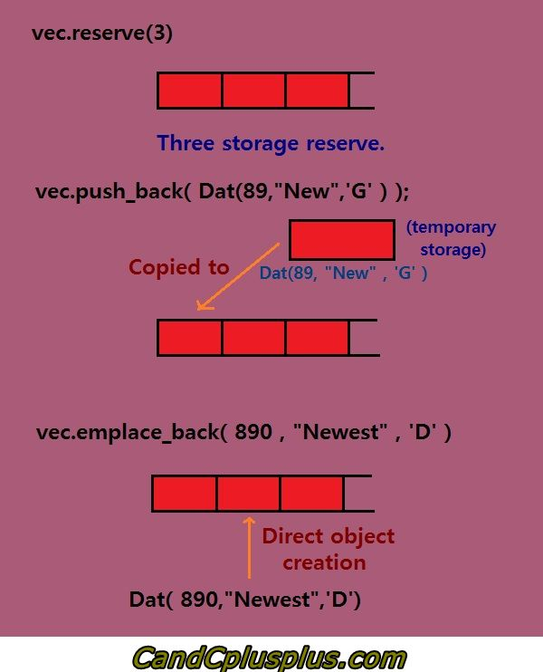

= Bilgisayarlı Görü ve Görüntü İşleme için Modern C ++
:TOC:

== 1. ÖZET

Bu seride değişkenler ve temel tipleri (built-in types(yerleşik tipler), strings(dizgi), vector, array(dizi)) ve control yapıları (if statement, switch statement, loops) örneklerle anlatılmaktadır.

== 2. GİRİŞ

=== 2.1. Değişkenleri Adlandırma

Değişken bildirimi her zaman aşağıdaki şekildedir:

----
<TYPE> <NAME> [ = <VALUE>];
----

* Her değişkenin bir türü vardır 
* Değişkenler türlerini değiştiremez
* Mümkünse değişkenleri tanımlarken başlangıç değeri verin
[source,C++]
----
1 int baslangıc_degeri_yok;
2 bool baslangıc_degeri_var = true;
----

//include::Değişken isimlendirme.adoc[]

* C++, **büyük ve küçük harflere karşı duyarlı**dır. Böylece ‘Sayi’ ve ‘sayi’ isminde 2 farklı değişken oluşturabilirsiniz hepsi ayrı değişken olarak algınalırlar.

* Değişkenlere *anlamlı adlar* verilmelidir.Bu yüzden değişken tanımlarken uzun isimlendirmeden çekinmeyin.(A, B, C vb. kısa anlamsız isimlendirmeler kodun okunurluğunu, anlaşılırlığını azaltır).Ayrıca değişken tanımlarken olumsuz ifadeler içeren isimler kullanmayın bu hem kafa karışıklığına hemde yavaş düşünmenize neden olur. 

* Değişkenlerin isimleri alfabede bulunan karakterlerle ya da _ (alt çizgi) ile başlamalı.Kesinlikle sayı veya özel karakter ile isimlendirmeye başlayamayız. Ama ilk harf hariç diğer karakterler sayı olabilir.

* Değişken isimlerinde C++ dilinin özel anahtar kelimelerini kesinlikle kullanamayız.

* Değişken isimleri birden fazla kelime olduğu zaman; kelimelerin arasına boşluk konmaz. Bu tür değişkenleri ya kelimeleri birleştirerek veya kelimeler arasına _ (alt çizgi) karakteri koyarak isimlendiririz.

* Değişken ismi en fazla 255 karakterden oluşabilir.

https://translate.google.com/?source=gtx_m#view=home&op=translate&sl=en&tl=tr&text=Google%20C%2B%2B%20Style%20Guide[Google C ++ Stil Kılavuzu]

=== 2.2. Built-in types
[source,cpp]
----
1 bool sonuc = false; // Boolean: doğru veya yanlış.
2 char karakter = '\n'; // Tek karakter.
3 int tam_sayi = 42; //  Tam sayı.
4 short kisa_tamsayi = 42; // Kısa numara.
5 long uzun_tamsayi = 42; // Uzun sayı.
6 float fraction = 0.01f; // virgüllü sayı.
7 double precise_num = 0.01; // virgülden sonrası çok olan sayi.
8 auto some_int = 13; // otomotik tip [int].
9 auto some_float = 13.0f; // otomotik tip [float].
10 auto some_double = 13.0; // otomotik tip [double].
----

https://en.cppreference.com/w/cpp/language/types[Daha fazla ayrıntı için....]

=== 2.3. Aritmetik tiplerde işlemler

* Tüm karakter(character), tamsayı(integer) ve kayan nokta(floating point) türleri aritmetiktir
* Aritmetik işlemler: +, -, *, /
* Karşılaştırma: <, >, <=, >=, == return bool
* a += 1 ⇔ a = a + 1, benzer şekilde -=, *=, /=, etc.
* Kayan nokta( floating point) türleri için *==* kullanmaktan kaçının 
* Boolean değişkenlerinin mantıksal işlemleri vardır;

veya(or): *||*  ve(and): *&&*  değil(not): *!*

[source,cpp]
----
1 bool mutlu_mu = (!ac && sıcak) || zengin_mi;
----
* Tamsayı değişkenleri üzerinde ek işlemler:

*/* tamsayı bölümü: 7 / 3 == 2 

*%* modüler bölümü: 7 / 3 == 1

Arttırma Operatörü: a{plus}{plus} ⇔ ++a ⇔ a += 1

Azaltma Operatörü: a-- ⇔ --a ⇔ a -= 1

[IMPORTANT]
====
Arttırma ve azaltma operatörlerini diğer ifedalerle kullanmayın.
Örneğin; a = (a{plus}{plus}) + ++b
====

[NOTE]
====
Progtamlama hakkında genel bilgi içeren Steve McConnell'ın Code Complete kitabı tavsiye edilir.
====

=== 2.4. Strings

* std::string kullanmak için #include <string> kütüphanesini eklemek lazım

* Strings ifadeler + ile birleştirilir

* str nin boş olup olmadığını kontrol etmek için *str.empty()* kullanılır

[source,cpp]
----
1 #include <iostream >
2 #include <string >
3 int main() {
4 std::string hello = "Hello";
5 std::cout << "Type your name:" << std::endl;
6 std::string name = ""; // Init empty.
7 std::cin >> name; // Read name.
8 std::cout << hello + ", " + name + "!" << std::endl;
9 return 0;
10 }
----

=== 2.5. Sabit boyutlu diziler için std::array kullanılır

* std::array kullanmak için #include<array>
kütüphanesini eklemek lazım

* Aynı tip verileri saklamak için kullanılır

* Verilerden oluşur, verilere ulaşmak oldukça hızlıdır:
[source,cpp]
----
array<float, 3> arr = {1.0f, 2.0f, 3.0f};
----
* *arr[i]* ile ögelere erişilir, indeks 0 ile başlar
 
* Depolanan öğe sayısı: *arr.size()* ile bulunur

* İlk elemana ulaşmak için *arr.front() == arr[0]* ifadesi kullanılır
 
* Son elemana ulaşmak için *arr.back() == arr[arr.size() - 1]* ifadesi kullanılır
 
=== 2.6. Bilinmeyen boyutlu diziler için std::vector kullanılır

* std::vector kullanmak için #include<vector>
kütüphanesini eklemek lazım

* Vektörler, elemanları saklamak için sürekli saklama yerleri kullanan dizi kaplarıdır. Depolamayı yönetebilir ve verimli bir şekilde dinamik olarak büyüyebilirler. Bu yeteneklerin bir bedeli vardır: vektörler, depolama ve dinamik olarak büyüyebilme yeteneği karşılığında daha fazla bellek tüketir.

* Depolanan öğelere std :: array'deki gibi erişilir

* Tüm ögeleri silmek için *vec.clear()* kullanılır

* İki yoldan biriyle yeni bir öğe ekleyin:
** vec.emplace_back(value) [tercihli, c++11]
** vec.push_back(value) [tarihsel olarak daha iyi bilinen]

* Kullanın! Hızlı ve esnektir!
Bunun varsayılan bir kapsayıcı olduğunu düşünün aynı türden eşya koleksiyonlarını depolar
* *push_back/emplace_back* operatörleri birden fazla kez vektörün boyutunu değiştirebilir

* *reserve(n)* vektörün *n* öğeyi saklamak için yeterli belleğe sahip olmasını sağlar

* *n* parametresi yaklaşık bile olabilir, bu çok önemli bir optimizasyon

==== 2.6.1.Vektörün boyutlandırılması 

===== push_back

push_back fonksiyonunun tek amacı, vektörün sonuna eleman eklemektir. Dizilerde depolama alanı boyutu sabittir ve dizi boyutunu büyütmemiz gerekiyorsa, daha büyük boyutlu başka bir dizi ayırmalı ve içeriği yeni diziye kopyalamalıyız.Bu şüphesiz ekstra kod gerektirir ve içeriği yeni diziye kopyalamak Süreç tekrarlanır hale gelir ve böylece programınızı fazlasıyla yavaşlatır.Düzeltme boyutu dizisini kullanırken meydana gelebilecek tüm durumdan kaçınmak için, vektörle değiştirebilir ve bellek ayarı ne kadar büyük olursa olsun, vektöre ekstra veri eklemek istediğimizde 'push_back' işlevini çağırabiliriz.Vektörde 'push_back' işlevinin iki sürümü vardır.(ilki C++11'e eklenir.)

*T : vektörün veri türü.*

====== *1*.  void push_back(T&& x) ; (C++11)

 
Parametreler:X - vektörün sonuna eklenecek değer.

Dönüş türü:void

Bu fonksiyon eklenecek veri bir değer olduğunda çağrılır, örneğin hazır bir bilgi.Bir değer kabul ettiğinden, verileri kopyalamak yerine verileri taşır.Bu işlev, depolama alanı daha önce rezerve edilmemişse vektörün kapasitesini artırır.Ancak, depolama reserve() işlevini kullanarak rezerve edilirse, bu işlevi çağırmak yalnızca kapasitesini değil boyutunu artırır.Ayrılmış boyuttan daha fazla veri eklediğinizde kapasite artacaktır.

====== *2*. void push_back(const T& x);

Parametreler:X - vektörün sonuna eklenecek değer.

Dönüş türü:void

Bu push_back fonksiyonu, argüman olarak bir değer veya referans ilettiğinizde çağrılır.Bu işlevi çağırırken, vektörün biraz depolama alanı ayırması durumunda kapasite aynı kalır, ancak kapasite yoksa, boyutu ile birlikte artacaktır.

====== Emplace_back ve push_back fonksiyonları arasındaki fark

Her ne kadar C {plus}{plus} emplace_back ve push_back fonksiyonları vektörün sonuna veri eklemek olsa da, aralarında bazı farklılıklar vardır. Ve bahsetmeye değer küçük farklılıklardan biri de push_back fonksiyonunun zamandan beri Standart C {plus}{plus} 'ın bir parçası olmasıdır bununla birlikte, emplace_back işlevi dile yeni bir ektir. Yakın zamanda C {plus}{plus} 11 özellikleri altına eklenmiştir.

*Fark 1:* push_back, yapıcı birden fazla argümanı kabul ederse, türün tek nesnesini kabul ederken, emplace_back, türün yapıcısının argümanlarını kabul eder.Bu fark sadece kurucu birden fazla argümanı kabul ettiğinde ortaya çıkar. Push_back çağrılırken yalnızca bir argümanı kabul eden kurucuda, nesneyi iletmek yerine kurucu türünün argümanını iletebiliriz. Bir bağımsız değişken yapıcısı için ham veri - nesne içi push_back öğesinin bu kabulü, push_back işlevinin C {plus}{plus} 11 sürümüne bağlıdır. C {plus}{plus} 11 sürümü, iletilen argümandan nesnenin oluşturulmasına izin verir, bu daha sonra vektör kabına itilir.
Yapıcı iki veya daha fazla bağımsız değişkeni kabul ederse, türün nesnesini açıkça iletmeniz gerekir.

*Fark 2:* Verimlilik, 
'Verimlilik' kelimesinin burada farklı anlamları olabilir, burada daha hızlı çalışma anlamında inceliyeceğiz.İlk olarak, vektör türünün yerleşik bir tür olduğunu görelim ve sonra kullanıcı tanımlı tür için göreceğiz.

[underline]#built-in type(yerleşik tip)#

Tür yerleşik bir türse, push_back ve emplace_back işlevi arasında verimlilik farkı yoktur.

[underline]#User-defined type(Kullanıcı tanımlı tip)#

Vektör türü bir sınıf veya yapı i ise, e. kullanıcı tanımlı bir tür, bu durumda emplace_back'in push_back işlevinden daha verimli olduğu, neden ve nasıl?

tür kullanıcı tanımlı tür olduğunda push_back çağrısı

Nesneyi (nesne oluşturulmadan önce) push_back kullanarak doğrudan vektöre eklemeye çalışırsak, bu işlemde önce geçici bir nesne oluşturulur. Geçici nesne oluşturulurken üç adım oluşur:
 
i) Geçici nesne oluşturmak için bir yapıcı çağrılır.
 
ii) Daha sonra vektörde geçici nesnenin bir kopyası oluşturulur.
 
iii) Nesneyi kopyaladıktan sonra, yıkıcı geçici nesneyi yok etmek için çağrılır.

Push_back çağrıldığında meydana gelen üç işlemin doğrulaması bu yazının altında, 'Yan Not' bölümünde gösterilir.

tür kullanıcı tanımlı tür olduğunda emplace_back çağrısı

Emplace_back kullanılırsa, bunun yerine nesne doğrudan vektörde oluşturulur. Emplace_back ile geçici nesnenin gereksiz yaratılmasından kaçınılır. Böylece performans artırıldı.

Aşağıdaki resimsel gösterim daha iyi anlamanıza yardımcı olabilir.  

[source , cpp]
----
1 std::vector <std::string > vec;
2 const int kIterNum = 100;
3 // Always call reserve when you know the size.
4 vec.reserve(kIterNum);
5 for (int i = 0; i < kIterNum; ++i) {
6 vec.emplace_back("hello");
7 }
----
==== 2.6.2. Vektör örneği

[source ,C++]
----

1 #include <string >
2 #include <vector >
3 #include <iostream >
4 using namespace std;
5 int main() {
6 vector <int> numbers = {1, 2, 3};
7 vector <string > names = {"Igor", "Cyrill"};
8 names.push_back("another_string");
9 cout << "First name: " << names.front() << endl;
10 cout << "Last number: " << numbers.back() << endl;
11 return 0;
12 }

----

image::Vector-vs-Array.jpg[]

=== 2.7. Değişkenlerin kapsam alanı

* Tek bir global kapsam vardır 
* Yerel kapsamlar *{}* ile biter 
* Tüm değişkenler bildirildikleri kapsama aittir 
* Tüm değişkenler kapsamlarının sonunda ölür 
* Bu C ++ bellek sisteminin çekirdeğidir

[source , cpp]
----
1 int main() { // Start of main scope.
2 float some_float = 13.13f; // Create variable.
3 { // New inner scope.
4 auto another_float = some_float; // Copy variable.
5 } // another_float dies.
6 return 0;
7 } // some_float dies.
----

==== 2.7.1. Herhangi bir değişken const(sabit) olabilir
* Sabit bildirmek için const kullanın
* Derleyici herhangi bir değişiklikten koruyacaktır
* Anahtar kelime const herhangi bir tür ile kullanılabilir
* GOOGLE-STYLE küçük bir k harfiyle başlayan CamelCase ad sabitleri:

[source, cpp]
----
 const float kImportantFloat = 20.0f;
 const int kSomeInt = 20;
 const std::string kHello = "hello";
----

[TIP]
====
Değiştirilmemesi gereken değişkenleri *const* ile tanımla
====

=== 2.8. Değişkenlere referanslar

* Herhangi bir değişkene referans oluşturabiliriz
* Bir değişkenin bir referans olduğunu belirtmek için *&* kullanın

[source , cpp]
----
//Referans türün bir parçasıdır
float& ref = original_variable;
//ref değişkeni float& tipine sahiptir
std::string& hello_ref = hello;
----
* Bir referansa ne olursa değişkene de olur ayrıca tam terside geçerlidir
* Referanslar veri kopyalamayı önlediğinden performans kazancı sağlar

==== 2.8.1 Referans ile const kullanımı
* Referanslar hızlıdır ancak kontrolü azaltır
* İstenmeyen değişiklikleri önlemek için const kullanın

[source, cpp]
----
const float& ref = original_variable;
const std::string& hello_ref = hello;
----

.örnek uygulama
[source, cpp]
----
1 #include <iostream >
2 using namespace std;
3 int main() {
4 int num = 42;
5 int& ref = num;
6 const int& kRef = num;
7 ref = 0;
8 cout << ref << " " << num << " " << kRef << endl;
9 num = 42;
10 cout << ref << " " << num << " " << kRef << endl;
11 return 0;
12 }
----

=== 2.9 if ifadesi

[source, cpp]
----
1 if (koşul) {
2 // if koşulu == true ise bu kısım çalışır
3 } else if (diğer_koşul) {
4 // Bu kısım çalışır if:(koşul == false) && (diğer_koşul == true)
5 } else {
6 // İkiside doğru değilse burası çalştırılır
7 }
----
* Koşula bağlı kod çalıştırmak için kullanılır
* Gerekirse diğer tüm durumlar göz ardı edilebilir
* Koşul, herhangi bir boole ifadesi olabilir

=== 2.10. Switch ifadesi

[source, cpp]
----
1 switch(Seçim) {
2 case CONST_1:
3 // CONST_1 secilmişse bu kısım çalışır
4 break;
5 case CONST_2:
6 // CONST_2 secilmişse bu kısım çalışır
7 break;
8 default:
9 // seçenekler dışında bir seçim yapılmışsa bu kısım çalışır
10 }
----

* Seçime bağlı kod çalıştırmak için kullanılır
* Çok sayıda vaka ifadesi olabilir
* break deyimi switch bloğundan çıkarır
* Seçim genellikle int veya enum değerini döndürür

=== 2.11. Döngüler

==== 2.11.1 While

----
 while (Koşul) {
// koşul sağlandığı sürece döngü döner
 }
----

.while döngüsü için örnek
[source, cpp]
----
1 bool kosul = true;
2 while (kosul) {
3 kosul = /*Kosulun döngü içerisinde güncellenmesi */
4 }
----

==== 2.11.2 For

----
for (başlangıç_koşulu; son_bulma_koşulu; artış) {
// on_bulma_koşulu == false olana kadar döngü döner
 }
----

.for döngüsü için örnek
[source, cpp]
----
1 for (int i = 0; i < COUNT; ++i) {
2 // COUNT kez döngü döner
3 }
----

* C++ da for dögüsü çok hızlıdır
* *while* döngüsünden daha az esnek ama hata eğilimide daha az
* Döngünün son bulma koşulu bilindiğinde *for*  döngüsünün kullanımı tavsiye edilir

==== 2.11.3 Döngü Aralığı

Yineleyebileceğiniz herhangi bir şey olarak tanımlanan bir "aralık" aracılığıyla yürütülmesi gereken döngüler ile tanımlanır.Dizi veya vektör gibi standart kapsayıcılar üzerinde yineleme daha basit sözdizimine sahiptir.C ++ 11'e eklendi.

[source, cpp]
----
1 for (const auto& value : container) {
2 // This happens for each value in the container.
3 }
----

 
For-range-declaration bölümünde bildirilen ad, for ifadesinde yereldir ve ifade veya deyimde yeniden bildirilemez.

[IMPORTANT]
====
https://docs.microsoft.com/tr-tr/cpp/cpp/auto-cpp?view=vs-2019[auto] anahtar kelimenin, ifadenin aralık aralığı bildirimi bölümünde tercih edildiğini unutmayın.
====

==== 2.11.4 Döngüde Çıkış ve Devam

* Döngü üzerinde kontrolümüz vardır
* Döngüden çıkmak için *break* 'i kullanın
* Sonraki yinelemeye geçmek için **continue **'i kullanın

[source, cpp]
----
1 while (true) {
2 int i = /* Magically get new int. */
3 if (i % 2 == 0) {
4 cerr << i << endl;
5 } else {
6 break;
7 }
8 }
----

==== 2.12 Git

* Dağıtılmış sürüm kontrolü için ücretsiz yazılımdır
* yerel ve uzak dosyaları senkronize eder
* tüm değişikliklerin geçmişini saklar

[underline]#Senkronize nedir?#

* Bilgisayardaki yerel dosyalar
* Depodaki uzak dosyalar
* Bir Gitlab sunucusu kullanıyoruz

Örnek veri havuzu: https://gitlab.igg.uni-bonn.de/teaching/cpp-homeworks-2018

*İş akışı*

Bir depoyu klonlama:

* git clone <repo_url> <local_folder>
In <local_folder>
* git add <files>
* git commit -am 'descriptive message'
* git push origin master 

[IMPORTANT]
====
http://rogerdudler.github.io/git-guide/index.tr.html[Basit-Türkçe_Git rehberi]
====

== Referanslar

Cpp Core Guidelines:
https://github.com/isocpp/CppCoreGuidelines

Google Code Styleguide:
https://google.github.io/styleguide/cppguide.html

Git guide:
http://rogerdudler.github.io/git-guide/

C++ Tutorial:
http://www.cplusplus.com/doc/tutorial/

Book: Code Complete 2 by Steve McConnell

http://candcplusplus.com/c-vectorpush_back-c11-push_back-function#1st_ver

