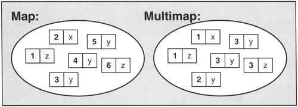

= Multimap

Map gibi çalışır fakat ek olarak, aynı ada sahip birden fazla ögenin varlığına da izin verir.

.Map ve Multimap Sembolik Venn Şeması Gösterimi

.Örnek
[source,c++]
----
#include <iostream>
#include <map>

struct Nokta { double x, y; };
struct NoktaCmp {
    bool operator()(const Nokta& lhs, const Nokta& rhs) const {
        return lhs.x < rhs.x; // NB. ignores y on purpose
    }
};

int main() {
    std::multimap<int, int> multimap1 = {{1,2},{2,1},{3,3},{7,4},{4,5},{4,4},{3,3},{2,2},{3,3}}; //Multimap ile uye atamasi.
    for(auto& p: multimap1)
        std::cout << p.first << ' ' << p.second << '\n';

    std::multimap<Nokta, double, NoktaCmp> multimap2{
            { {8, 12}, 15 },
            { {4, 7}, 7 },
            { {8, 15}, 17 },
            { {3, -3}, -5 },
    }; //Multimap ile uye atamasi.
    for(auto p : multimap2)
        std::cout << "(" << p.first.x
                  << ", " << p.first.y << ") is "
                  << p.second << '\n';
}
----

Çıktı:
[source,]
----
1 2
2 1
2 2
3 3
3 3
3 3
4 5
4 4
7 4
(3, -3) is -5
(4, 7) is 7
(8, 12) is 15
(8, 15) is 17
----

.Örnek
[source,c++]
----
#include <map>
#include <iostream>
/**
 * Multimap kopyalama ve tasima islemi yapilmistir.
 */
using namespace std;
void boyutuYazdir(const multimap<int,int> &sayilar1,
                   const multimap<int,int> &sayilar2,
                   const multimap<int,int> &sayilar3)
{
    cout << "sayilar1: " << sayilar1.size()
              << " sayilar2: " << sayilar2.size()
              << " sayilar3: " << sayilar3.size() << '\n';
}
//size(): Boyutu dondurur.
int main()
{
    std::multimap<int, int> sayilar1 {{3, 1}, {4, 1}, {5, 9}, 
                                   {6, 1}, {7, 1}, {8, 9}};
    std::multimap<int, int> sayilar2; 
    std::multimap<int, int> sayilar3;
 
    cout << "Tanimlanan:\n";
    boyutuYazdir(sayilar1, sayilar2, sayilar3);

    sayilar2 = sayilar1;
    cout << "Kopyalanan:\n";
    boyutuYazdir(sayilar1, sayilar2, sayilar3);

    sayilar3 = move(sayilar1);
    //move(): Yollanani tasir.
    cout << "Tasinan:\n";
    boyutuYazdir(sayilar1, sayilar2, sayilar3);
}
----

Çıktı:
[source,]
----
Tanimlanan:
sayilar1: 6 sayilar2: 0 sayilar3: 0
Kopyalanan:
sayilar1: 6 sayilar2: 6 sayilar3: 0
Tasinan:
sayilar1: 0 sayilar2: 6 sayilar3: 6
----

.Örnek
[source,c++]
----
#include <map>
#include <iostream>
#include <utility>

int main()
{
    std::multimap<int, int> sayilar;

    std::cout << "Bos mu?: " << sayilar.empty() << std::endl; //1 ise bos
    //empty(): Eleman olup olmadigini kontrol eder.

    sayilar.emplace(42, 13);
    //emplace(): Kurucu ile dogrudan atama.
    sayilar.insert(std::make_pair(13317, 123));
    //insert(): pair olarak olusturulan multimap e eklenir.
    std::cout << "Bos mu?: " << sayilar.empty() << std::endl; //1 ise bos
    
    std::cout << "Boyut: " << sayilar.size() << std::endl;
    //size(): Boyutu dondurur.

    std::cout << "Tanimlanabilecek en buyuk boyut: " << sayilar.max_size() << std::endl;
    //max_size():Tanimlanabilecek en buyuk boyutu dondurur.

    sayilar.clear();
    //Multimap in bütün elemanlarini siler.
    std::cout << "Boyut: " << sayilar.size() << std::endl;
}
----

Çıktı:
[source,]
----
Bos mu?: 1
Bos mu?: 0
Boyut: 2
Tanimlanabilecek en buyuk boyut: 178956970
Boyut: 0
----

.Örnek
[source,c++]
----
#include <map>
#include <iostream>
int main()
{
    std::multimap<int, std::string> sayi  = {{1, "bir"}, {2, "iki"}, {3, "uc"},
                                    {4, "dort"}, {5, "bes"}, {6, "alti"}};

    for(auto i = sayi.begin(); i != sayi.end(); )
        if(i->first % 2 == 1)  //tek sayilari sil
            i = sayi.erase(i);
            //erase(): Eleman silme islemi.
        else
            ++i;
    for(auto& p : sayi)
        std::cout << p.second << ' ';
}
----

Çıktı:
[source,]
----
iki dort alti
----

.Örnek
[source,c++]
----
#include <iostream>
#include <map>
 
int main()
{  
    std::multimap<int,char> aranacak = {{1,'a'},{2,'b'}};

    auto ara = aranacak.find(2); 
    //find(): Gonderilen anahtari elemanlarda ara.
    if(ara != aranacak.end()) {
        //end(): Map in son elemanini dondurur.
        std::cout << "Bulundu: " << ara->first << " " << ara->second << std::endl ;
    }
    else {
        std::cout << "Bulunamadi\n";
    }
}
----

Çıktı:
[source,]
----
Bulundu: 2 b
----

.Örnek
[source,c++]
----
#include <iostream>
#include <map>
 
int main()
{
    std::multimap<int, char> anahtar {
        {1, 'A'},
        {2, 'B'},
        {2, 'C'},
        {2, 'D'},
        {4, 'E'},
        {3, 'F'}
    };
 
    auto ata = anahtar.equal_range(2);
    //equal_range():2 olanları ata.
 
    for (auto i = ata.first; i != ata.second; ++i)
    {
        std::cout << i->first << ": " << i->second << '\n';
    }
}
----

Çıktı:
[source,]
----
2: B
2: C
2: D
----

.Örnek
[source,]
----
#include <iostream>
#include <map>
#include <vector>

using namespace std;

class TelephoneDirectory
{
public:

    void add_entry(string name, int number);
    int find_entry(string name);
    vector<string> find_entries(int number);
    void print_all();

private:
    map<string, int> database;
    multimap<int, string> inverse_database;
};

void TelephoneDirectory::add_entry(string name, int number)  //Kisi ekle.
{
    database[name] = number;
    inverse_database.insert(make_pair(number, name));
}

int TelephoneDirectory::find_entry(string name)  //Isme ait numarayi dondurur
{
    map<string, int>::iterator p = database.find(name);
    if (p == database.end())  // Veri tabaninin sonuna kadar kontrol eder.
        return 0; // not found
    else
        return p->second;
}

vector<string> TelephoneDirectory::find_entries(int number) //Numaraya tanimli kisileri dondurur.
{
    multimap<int, string>::iterator lower
            = inverse_database.lower_bound(number); //Gonderilen numaraya tanimli ilk kisiye esitler.
    multimap<int, string>::iterator upper
            = inverse_database.upper_bound(number); //Gonderilen numaraya tanimli son kisiye esitler.
    vector<string> result;

    for (multimap<int, string>::iterator pos = lower; //Numaraya tanimli kisileri bastirir.
         pos != upper; pos++)
        result.push_back(pos->second);
    return result;
}

void TelephoneDirectory::print_all()  //Baslangıctan sona kadar rehberi yazdirir.
{
    for (map<string, int>::iterator pos = database.begin();
         pos != database.end(); pos++)
    {
        cout << pos->first << ": " << pos->second << "\n";
    }
}

int main()
{
    TelephoneDirectory data;
    data.add_entry("Fred", 7235591);
    data.add_entry("Mary", 3841212);
    data.add_entry("Sarah", 3841212);
    cout << "Number for Fred: " << data.find_entry("Fred") << "\n";
    vector<string> names = data.find_entries(3841212);
    cout << "Names for 3841212: ";
    for (unsigned int i = 0; i < names.size(); i++)
        cout << names[i] << " ";
    cout << "\n";
    cout << "All names and numbers:\n";
    data.print_all();
    return 0;
}

----

Çıktı:
[source,]
----
Number for Fred: 7235591
Names for 3841212: Mary Sarah
All names and numbers:
Fred: 7235591
Mary: 3841212
Sarah: 3841212
----

