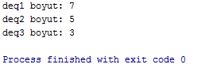
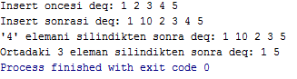

= Deque (Double-Ended Queue)

Deque'ler, dinamik boyutlu, her iki ucundan da genişletilebilen sequence konteynırlardır.

Vektörler ile benzer fonksiyonelliğe sahiptirler fakat verimli ekleme ve silme işlemi hem sonda hem de başta yapılabilir. Yine de ortaya ekleme veya ortadan silme işlemi yavaştır (O(n)). Ekleme ve silme işlemlerinin genellikle uçtan yapılmadığı durumlarda list ve forward list'ler deque'lere göre daha iyi performans gösterecektir.

[source,c++]
----
#include <iostream>
#include <deque>

using namespace std;

int main() {

    deque deq;
    deque<double> deq2 = {3.56, 85.42, 7.01};

    for(int i = 0; i <= 5; ++i)
        deq.push_back(i);//Sona ekleme (hızlı): O(1)

    for(int i = -1; i >= -5; --i)
        deq.push_front(i);//Başa ekleme (hızlı): O(1)

    for(auto itr = deq.cbegin(); itr != deq.cend(); ++itr)//cbegin ve cend constant iteratördür, bu iteratörler
        cout << *itr << " ";//read-only'dir yani değeri değiştirilemez, sadece yazdırılabilir

    cout << endl;

    for(auto itr = deq.crbegin(); itr != deq.crend(); ++itr)//rbegin ve rend reverse iteratördür, bu iteratörler
        cout << *itr << " ";//tersten başlayıp başa doğru ilerler. rbegin() ilk elemanın reverse'ü yani son eleman,
    //rend() son elemanın reverse'ü yani ilk elemanı gösterir.

    cout << endl;

    cout << "Boyut: " << deq.size() << endl;
    cout << "Maksimum Boyut: " << deq.max_size() << endl;

    if(deq2.empty())
        cout << "deq2 bostur." << endl;
    else
        cout << "deq2 bos degildir." << endl;

    deque<float> bosDeque;

    if(bosDeque.empty())
        cout << "Bu deque bostur." << endl;
    else
        cout << "Bu deque bos degildir." << endl;

    cout << "Resize ile buyutmeden once deq2: ";
    for(auto itr = deq2.cbegin(); itr != deq2.cend(); ++itr)
        cout << *itr << " ";

    cout << endl;

    deq2.resize(5);
    cout << "Resize ile buyuttukten sonra deq2: ";
    for(auto itr = deq2.cbegin(); itr != deq2.cend(); ++itr)
        cout << *itr << " ";

    cout << endl;

    deq2.resize(3);

    cout << "Resize ile kucultmeden once deq2: ";
    for(auto itr = deq2.cbegin(); itr != deq2.cend(); ++itr)
        cout << *itr << " ";

    cout << endl;

    deq2.resize(2);
    deq2.shrink_to_fit();//Bu fonksiyon resize ile deque küçültüldüğünde
    // çıkartılan elemanların hafızadan bırakılmasını(silinmesini) sağlar
    //Daha sonra resize ile boyutu 3 yapılırsa 3. eleman 0 olacaktır

    cout << "Resize ile kuculttukten sonra deq2: ";
    for(auto itr = deq2.cbegin(); itr != deq2.cend(); ++itr)
        cout << *itr << " ";

    cout << endl;

    cout << "deq'in ilk elemani: " << deq.front() << endl;
    cout << "deq'in son elemani: " << deq.back() << endl;
    cout << "deq'in 3. elemani" << deq.at(3) << endl;
    cout << "deq'in 5. elemani" << deq[5] << endl;

    cout << "ilk ve son elemani silinmeden once deq: ";
    for(auto itr = deq.cbegin(); itr != deq.cend(); ++itr)
        cout << *itr << " ";

    cout << endl;

    deq.pop_front();
    deq.pop_back();

    cout << "ilk ve son elemani silindikten sonra deq: ";
    for(auto itr = deq.cbegin(); itr != deq.cend(); ++itr)
        cout << *itr << " ";

    cout << endl;

    return 0;
}
----

image::deque1.png[]

[source,c++]
----
#include <iostream>
#include <deque>

using namespace std;

int main() {

    deque deq1;
    deque deq2;
    deque deq3;

    deq1.assign(7, 100); //deq1'e 7 adet 100 değeri atar
    //assign() eski değerleri siler ve yeni değerler ekleyip boyutunu ayarlar

    auto itr = deq1.begin() + 1;

    deq2.assign(itr, deq1.end()-1);

    int dizi[] = {8, 23, 42};
    deq3.assign(dizi, dizi+3);//Diziden atama

    cout << "deq1 boyut: " << deq1.size() << endl;
    cout << "deq2 boyut: " << deq2.size() << endl;
    cout << "deq3 boyut: " << deq3.size() << endl;

    return 0;
}
----

[source,c++]
----
#include <iostream>
#include <deque>

using namespace std;

int main() {

    deque deq;

    for(int i = 1; i <= 5; ++i)
        deq.push_back(i);// O(1)

    cout << "Insert oncesi deq: ";
    for(auto itr = deq.cbegin(); itr != deq.cend(); ++itr)
        cout << *itr << " ";

    cout << endl;

    auto itr = deq.begin() + 1;

    deq.insert(itr,10);//Ortaya ekleme (yavaş): O(n)

    cout << "Insert sonrasi deq: ";
    for(auto itr = deq.cbegin(); itr != deq.cend(); ++itr)
        cout << *itr << " ";

    cout << endl;

    deq.erase(deq.end()-2);
    cout << "'4' elemani silindikten sonra deq: ";
    for(auto itr = deq.cbegin(); itr != deq.cend(); ++itr)
        cout << *itr << " ";

    cout << endl;

    deq.erase(deq.begin()+1, deq.begin()+4);
    cout << "Ortadaki 3 eleman silindikten sonra deq: ";
    for(auto itr = deq.cbegin(); itr != deq.cend(); ++itr)
        cout << *itr << " ";

    return 0;
}
----

[source,c++]
----
#include <iostream>
#include <deque>

using namespace std;

int main() {

    deque deque1 = {10, 20, 30, 40, 50, 60, 70};
    deque deque2 = {99, 88, 77};
    deque<double> doubleDeque = {3.14, 12.78};

    //deque1.swap(doubleDeque); //Tip uyuşmazlığı: int deque ile double deque swap edilemez

    cout << "deque1: ";
    for(auto itr = deque1.cbegin(); itr != deque1.cend(); ++itr)
        cout << *itr << " ";

    cout << endl;

    cout << "deque2: ";
    for(auto itr = deque2.cbegin(); itr != deque2.cend(); ++itr)
        cout << *itr << " ";

    cout << endl;

    deque1.swap(deque2);//deque1 ile deque2 içeriği yer değiştirir

    cout << "Swap sonrasi deque1: ";
    for(auto itr = deque1.cbegin(); itr != deque1.cend(); ++itr)
        cout << *itr << " ";

    cout << endl;

    cout << "Swap sonrasi deque2: ";
    for(auto itr = deque2.cbegin(); itr != deque2.cend(); ++itr)
        cout << *itr << " ";

    cout << endl;

    deque2.clear();//deque2'nin içerisindeki her şey silinir
    deque2.push_front(-5);

    cout << "clear() ve push_front(-5) sonrasi deque2: ";
    for(auto itr = deque2.cbegin(); itr != deque2.cend(); ++itr)
        cout << *itr << " ";

    cout << endl;

    deque2.emplace_front(1);
    deque2.emplace_back(10);
    deque2.emplace(deque2.begin()+1, 5);

    cout << "deque2.emplace_front(1); deque2.emplace_back(10); deque2.emplace(deque2.begin()+1, 5);  : ";
    for(auto itr = deque2.cbegin(); itr != deque2.cend(); ++itr)
        cout << *itr << " ";

    cout << endl;

    return 0;
}
----

image::deque4.png[]
