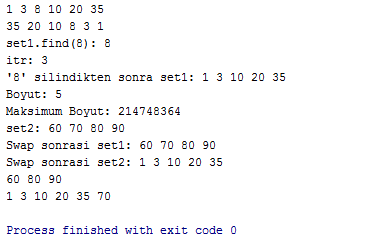

= Set

Set'ler eşsiz elemanları sıralı olarak saklayan konteynırdır. Eşsiz deyimi bir elemanın sadece bir kez kullanılabileceğini gösterir. Set içerisindeki elemanların değerleri değiştirilemez fakat eklenip silinebilirler. Elemanlar küçükten büyüğe sıralanırlar. Binary arama ağacı gibi çalışırlar.

[source,c++]
----
#include <iostream>
#include <set>

using namespace std;

int main() {

    set set1;

    auto it = set1.begin();

    //insert'in ilk parametresine iteratör vermek eklerken daha verimli olmayı sağlayabilir
    it = set1.insert(it, 8);
    it = set1.insert(it, 3);//Verimlilik değişmemiştir (3<8)
    it = set1.insert(it, 10);//Verimlilik artmıştır (10>3)
    it = set1.insert(it, 1);//Verimlilik değişmemiştir (1<10)
    //Binary tree tarzı ekleme yapar. O(log(n))

    set1.emplace(20);
    it = set1.emplace_hint(it, 35);

    for(auto itr = set1.cbegin(); itr != set1.cend(); ++itr)//cbegin ve cend constant iteratördür, bu iteratörler
        cout << *itr << " ";//read-only'dir yani değeri değiştirilemez, sadece yazdırılabilir

    cout << endl;

    for(auto itr = set1.crbegin(); itr != set1.crend(); ++itr)//rbegin ve rend reverse iteratördür, bu iteratörler
        cout << *itr << " ";//tersten başlayıp başa doğru ilerler. rbegin() ilk elemanın reverse'ü yani son eleman,
    //rend() son elemanın reverse'ü yani ilk elemanı gösterir.

    cout << endl;

    auto itr = set1.find(8);//Diğer sequence konteynırlar bu özelliği içermez. O(log(n))

    cout << "set1.find(8): " << *itr << endl;

    auto foo = set1.insert(3);//Bir eleman iki kez eklenemez
    if(foo.second == false)
        itr = foo.first;//itr artık 3 değerini gösteriyor

    cout << "itr: " << *itr << endl;

    set1.erase(8);//Sequence konteynırların hiçbirinde böyle bir silme yöntemi yoktur

    cout << "'8' silindikten sonra set1: ";
    for(auto itr = set1.cbegin(); itr != set1.cend(); ++itr)
        cout << *itr << " ";

    cout << endl;

    cout << "Boyut: " << set1.size() << endl;
    cout << "Maksimum Boyut: " << set1.max_size() << endl;//set'in alabileceği maksimum eleman sayısı

    set set2 = {90, 70, 60, 80};

    cout << "set2: ";
    for(auto itr = set2.cbegin(); itr != set2.cend(); ++itr)
        cout << *itr << " ";

    cout << endl;

    set1.swap(set2);

    cout << "Swap sonrasi set1: ";
    for(auto itr = set1.cbegin(); itr != set1.cend(); ++itr)
        cout << *itr << " ";

    cout << endl;

    cout << "Swap sonrasi set2: ";
    for(auto itr = set2.cbegin(); itr != set2.cend(); ++itr)
        cout << *itr << " ";

    cout << endl;

    auto e_itr = ++set1.begin();
    //set1.extract(e_itr);//O(1) //extract() C++ 17 ile gelmiştir
    //set1.extract(80);//O(log(n)) //Node handle

    set2.insert(set1.extract(e_itr));//e_itr iteratörünün işaret ettiği değer basit bir işlemle set1'den set2'ye taşındı

    for(auto itr = set1.cbegin(); itr != set1.cend(); ++itr)
        cout << *itr << " ";

    cout << endl;

   // set2.merge(set1);//O(n*log(n)) //merge() C++ 17 ile gelmiştir
    //Node handle

    for(auto itr = set2.cbegin(); itr != set2.cend(); ++itr)
        cout << *itr << " ";

    cout << endl;

    return 0;
}
----

