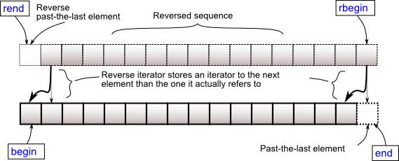

Vektörler, bir öğe yerleştirildiğinde veya silindiğinde depoları otomatik olarak kap tarafından otomatik olarak işlenirken kendisini yeniden boyutlandırabilen dinamik dizilerle aynıdır. Vektör öğeleri, yineleyicileri(iteratorleri) kullanarak erişilebilir ve dolaştırılacak şekilde bitişik depolamaya yerleştirilir. Vektörlerde veri sonuna eklenir. Bazen, dizinin uzatılmasına ihtiyaç duyulabileceği için, sonuna eklemenin farklı zamanları gerekir. Yeniden boyutlandırma yapılmadığından, son öğenin yenilenmesi yalnızca sabit bir zaman alır. Başlangıçta veya ortada ekleme ve silme zamanında doğrusaldır.

**Vector Tanımı**
Başlangıçta boyut vermeden tanımlamak için:
[source,C++]
----
std::vector<veri_tipi> vector_ismi;
----
Boyut belirterek tanımlamak için:

----
std::vector<veri_tipi> vector_ismi(boyut);
----

**Vektörlerle Birlikte Kullanılabilen Bazı Gerekli Fonksiyonlar**

* begin():Vektörün ilk elemanını döndürür.
* end(): Vektörün son elemanını döndürür. 
* rbegin(): Reverse iterator. Vectordeki son elemanı gösterir.
* rend(): Reverse iterator. Vectordeki ilk elemanın öncesini gösterir. 
**Örnek**

[source,C++]
----
#include <iostream>
#include <vector>

int main()
{
    std::vector v = {7, 5, 16, 8};
    v.push_back(25); 
    v.push_back(13);
    //vektörü ekrana yazdırmak için;
    for(int n : v) 
    {
        std::cout << n << '\n';
    }
}
----

* push_back(deger): fonksiyonu vectore eleman eklemek için kullanılır.
Sondan ekleme işlemi yapar.

**Ornek**
[source,C++]
----
#include <iostream>
#include <vector>//Vector kütüphanesini kullanmak için

int main()
{
    std::vector vec; // ilk tanımlama, vec.size()=0 size() fonksiyonu vectorun boyutunu verir.
    std::vector::iterator iter;// Vector iterator tanımı //
    std::vector::reverse_iterator r_iter;
    for(int i=0;i<5;i++)
    {
        vec.push_back(i+1);//
    }
    std::cout<<"Vectordeki elemanlar: (end ve begin ile):    ";

    for (iter=vec.begin(); iter!=vec.end(); ++iter)
    {
        std::cout<<*iter<<"\t";
    }
    std::cout<<"\n";
    std::cout<<"Vectordeki elemanlar: (rend ve rbegin ile):  ";
    for(r_iter=vec.rbegin(); r_iter!=vec.rend(); ++r_iter)
    {
        std::cout<<*r_iter<<"\t";
    }
    return 0;
}
----

**size():** Vevtördeki eleman sayısını ifade eder.

**max_size():** Vektörün tutabileceği maximum eleman sayısını belirtir.

**capasity():**Vektör için o anda ayrılan saklama alanının boyutunu, eleman sayısı olarak ifade eder.

**resize(size type g):** Vektörü verilen parametre kadar tekrar boyutlandırır.

**empty():** Vektörde eleman olup olmadığını kontrol etmek için kullanılır. True/ false döndürür.

**Ornek:**

[source,C++]
----
#include <iostream>
#include <vector>

#include <iostream>
#include <vector>

int main()
{
    std::vector<int> vec(5);
    for(int i=0;i<5;i++)
    {
        vec.push_back(i+2);
    }
    std::cout<<"Size:"<<vec.size()<<std::endl;
    std::cout<<"Kapasite"<<vec.capacity()<<std::endl;
    std::cout<<"Max_size:"<<vec.max_size()<<std::endl;
    return 0;
}
----

**Ornek:**
[source,C++]
----
#include <iostream>
#include <vector>
#include <string>

int main()
{
    std::vector<int> vec;
    for(int i=1;i<=10;i++)
    {
        vec.push_back(i*10);
    }
    std::cout<<"Reference operator [g] vec[2]:"<<vec[2]<<std::endl;
    
    std::cout<<"at: vec.at(4): "<<vec.at(4)<<std::endl;
    
    std::cout<<"front(): vec.front()= "<<vec.front()<<std::endl;
    
    std::cout<<"back(): vec.back()= "<<vec.back()<< std::endl;
}
----

**Ornek**:

[source,C++]
----
#include <iostream>
#include <utility>

int main()
{
    auto p = std::make_pair(1, 3.14);
    std::cout << '(' << std::get<0>(p) << ", " << std::get<1>(p) << ")\n";
    std::cout << '(' << std::get(p) << ", " << std::get<double>(p) << ")\n";
}
----

**Ekran Çıktısı:**

----
(1, 3.14)
(1, 3.14)
----

**Özellik**

C++17 ile;

----
template<class T1, class T2>  
pair(T1, T2) -> pair<T1, T2>;
----

Yukarıdaki bu kullanım ile, veri türünü otomatik olarak çıkartabilir.

==== Ornek kullanımlar

[source,C++]
----
#include <iostream>
#include <utility>
#include <vector>
#include <algorithm> //sort() algoritması için eklenmiştir.
#include <string>

int main()
{
    std::vector<std::pair<int, std::string>> v = 
    { {2, "baz"},{2, "bar"},{1, "foo"}}; // vectör pairi kullanımı gösterilmektedir.
    std::sort(v.begin(), v.end());//
    for(auto p: v) {
        std::cout << "(" << p.first << "," << p.second << ")\n";
    }
}
----

==== Ekran Çıktısı:

----
(1,foo)
(2,bar)
(2,baz)
----

* Yukarıdaki kodda 10.satırda sort() algoritması kullanılmıştır. <algorithm> kütüphanesinde tanımlıdır. Parametre olarak vektörün başını ve sonunu alarak sıralama işlemi yapar, buradaki sıralama işlemi ilk veri tipi olan, integer veri tipi üzerinde yapılmıştır.

