== Cevelop IDE kurulumu Ve Derleyici Ayarları

Cevelop IDe'sini https://www.cevelop.com/[buradaki] linkten indirebilirsiniz.

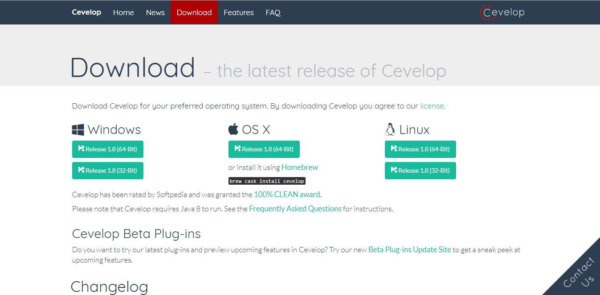

Açılan bu sayfadan işletim sisteminize uygun olan bağlantıdan indirebilirsiniz.

**Windows üzerinde kurulumu**

Açılan sayfadan windows olan seçeneği seçtiğinizde dosya .rar olarak indirilmeye başlayacaktır.

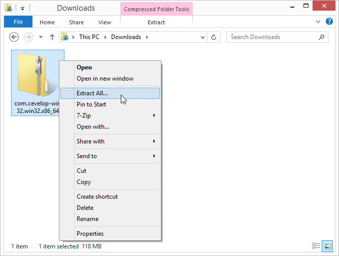

Dosyaları çıkartarak cevelop.exe uygulamasını çalıştırırsanız karşınıza böyle bir ekran çıkacaktır;

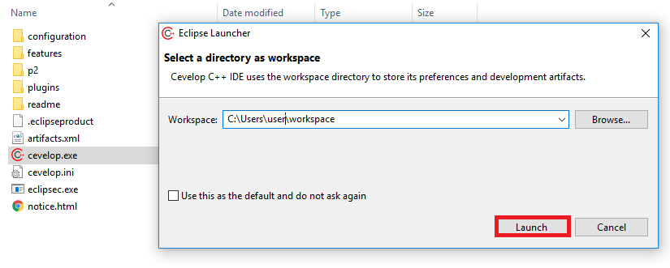

Launch dedikten sora karşınıza ilk olarak böyle bir sayfa açılacaktır.

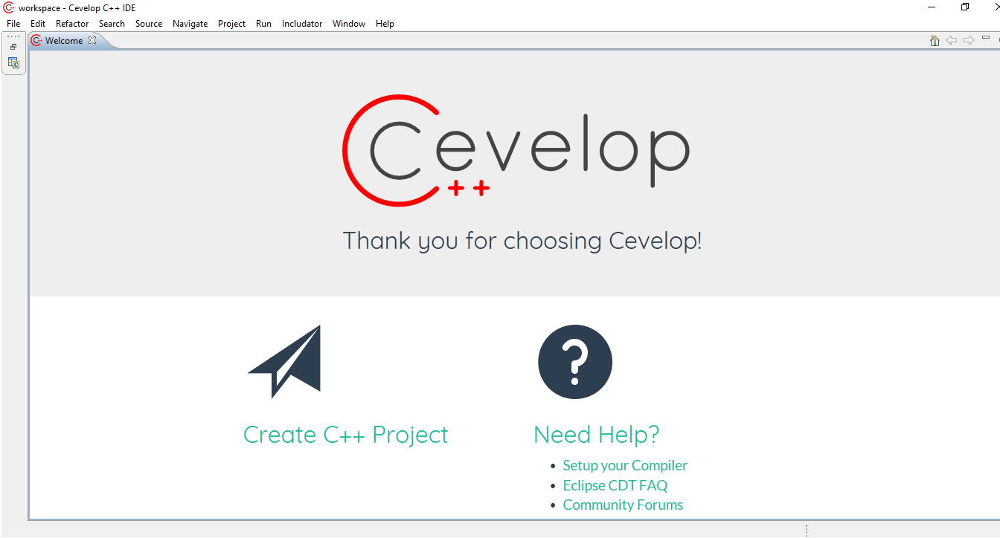

**Cevelop ile  Proje oluşturma**

Cevelopda proje oluşturmak için;

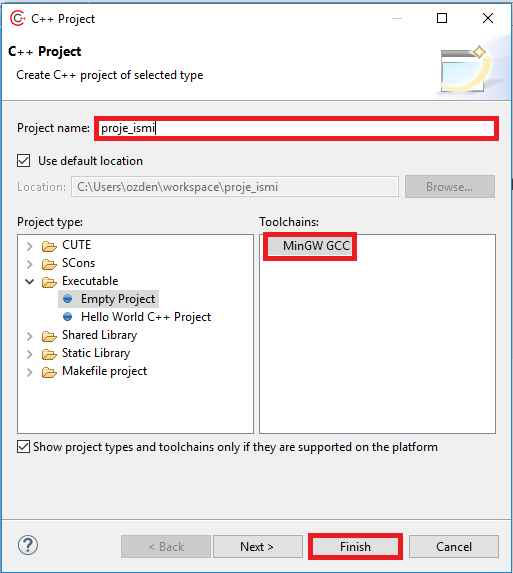

Sonrasında proje sağ tık-> properties kısmına geliniz.

**Kütüphane Eklemek için;**

C++17 destekli gcc 7.1 derleyicisini kullanarak kütüphane ekleme işlemlerini ve c{plus}{plus}
standardını ayarlama işlemlerini yapacağız.

image::kutuphane.png[]

* Burada Properties->Preprocessor Include Path, macros etc 
sekmesinde;

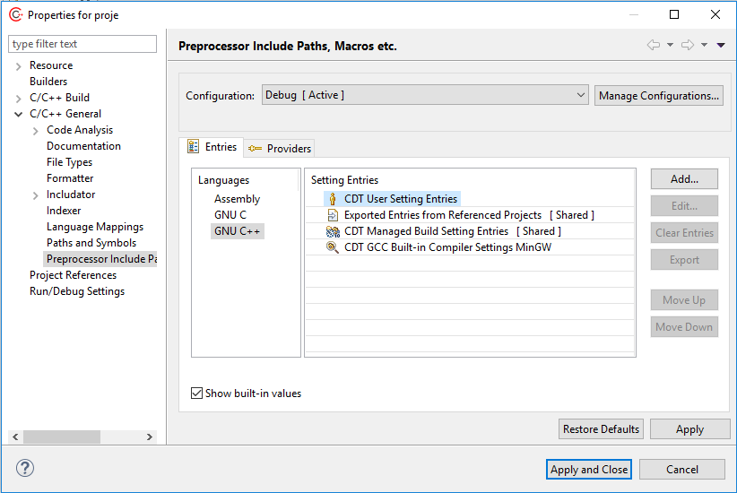

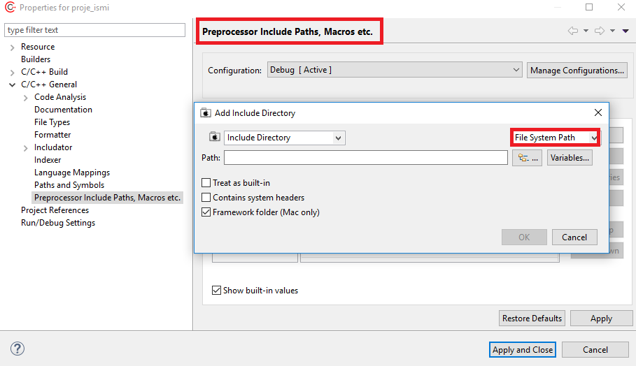

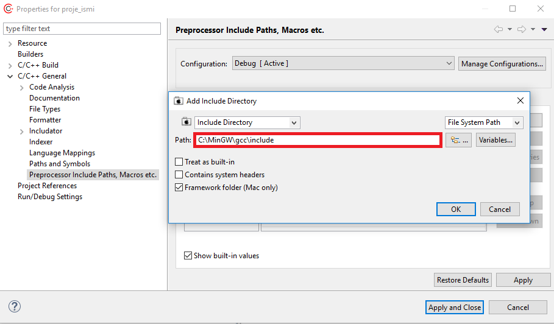

* Sonrasında Properties->C\C++ General -> Paths And Symsbols Kısmına da aynı kütüphane yolunu ekleyeceğiz.

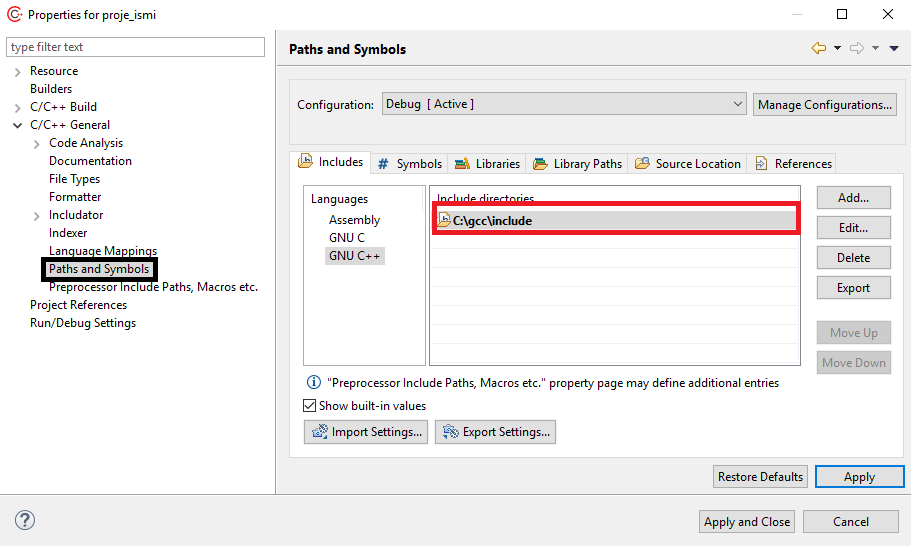

Kütüphane ayarlarını yaptıktan sonra;

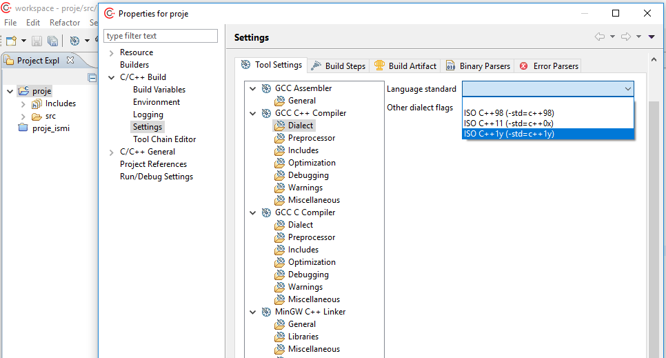

* C{plus}{plus} 17 standardında çalışacağımız için resimdeki gibi  seçiyoruz. ISO C{plus}{plus} 1y(-std=c++1y)

Sonrasında resimde gösterilen ayarı yapınız.

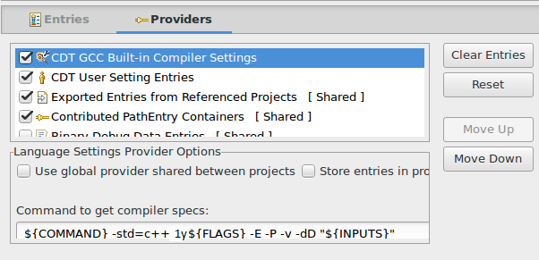

* Build ayarları için;

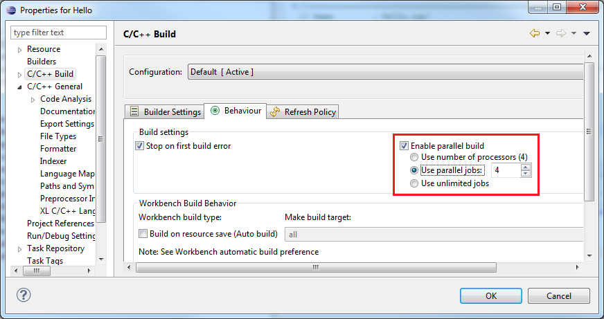

Build ayarrını da resimde gösterildiği gibi yapınız.

* Sonrasında Proje->Properties->C\C++ Build->settings  kısmına resimde gösterildiği gibi 

----
-std=c++1y
----

ekleyiniz.

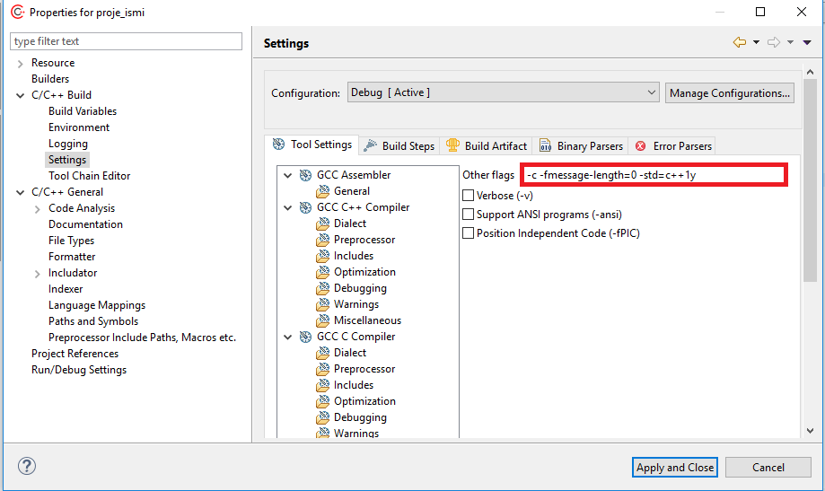

**İlk Proje açma ve derleme**

image::source_2.png[]

Sonrasında .cpp uzantılı source dosyasını açtığınızda boş bir proje açılacaktır.

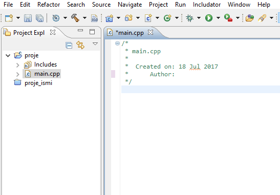

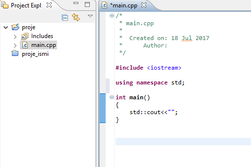

ilk kod olarak aşağıdaki kodu derleyip çalıştırabilirsiniz.

----
#include <iostream>
int main()
{
    std::cout<<"Hello World";
    return 0;
}
----

** Projeyi derlemek için**

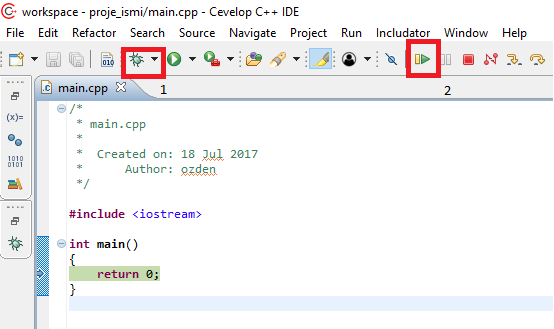

* Resimdeki 1 numara ile gösterilen kısım derlemk için.

* 2 numara ile gösterilen kısım derledikten sonra çalıştırmak içindir.

**Debug Ayarları**

Yukarıdaki resimden 1 numara ile gösterilen alana tıklayınız. 

Debug Configurations->C\C++ Application sekmesine tıklayınız.

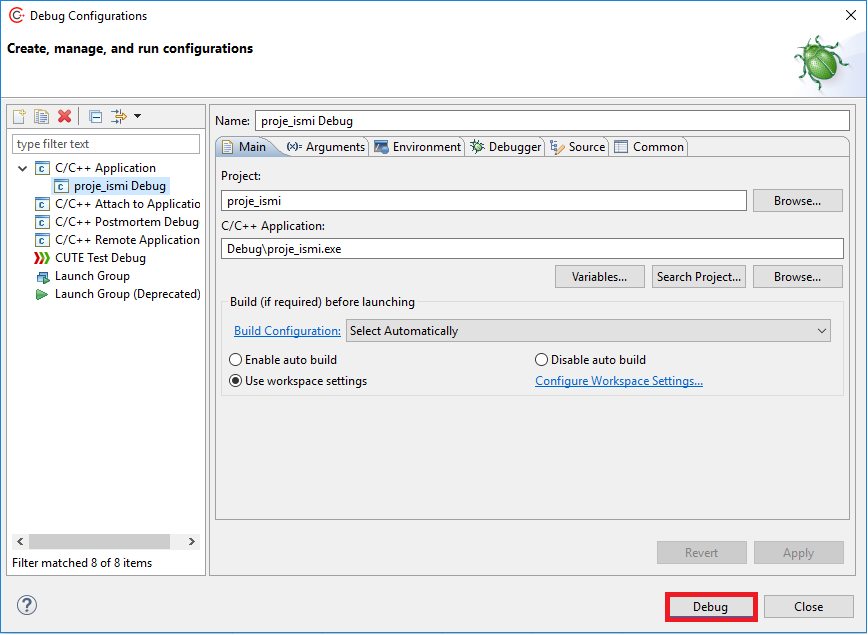

Resimde gösterildiği gibi debug edebilirsiniz.

==== Ubuntu Üzerinde Cevelop Kurulumu

**C++ 17 için GCC 7.1 derleyicisini kurmak:**

Linux işletim sisteminde;
Terminal'i açarak aşağıdaki kodları ekleyiniz.

----
sudo add-apt-repository ppa:jonathonf/gcc-7.1
sudo apt-get update
sudo apt-get install gcc-7 g++-7
----

GCC-7.1 derleyicisini kurdurduktan sonra;

https://www.cevelop.com/download/[Buradan] cevelop IDE'sini linux için indirebilirsiniz.

İndirdikten sonra indirdiğiniz klasöre giderek resimde gösterildiği gibi;

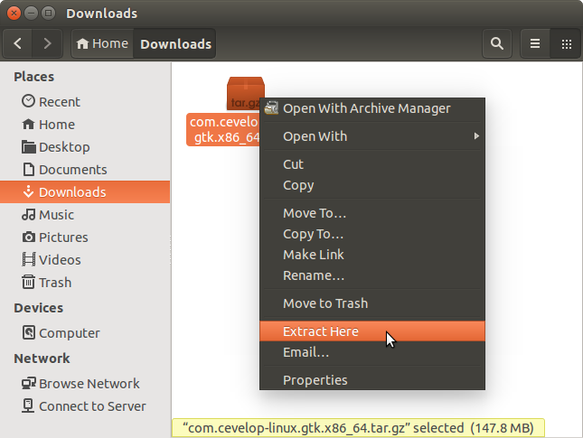

Dosyaları çıkartınız.

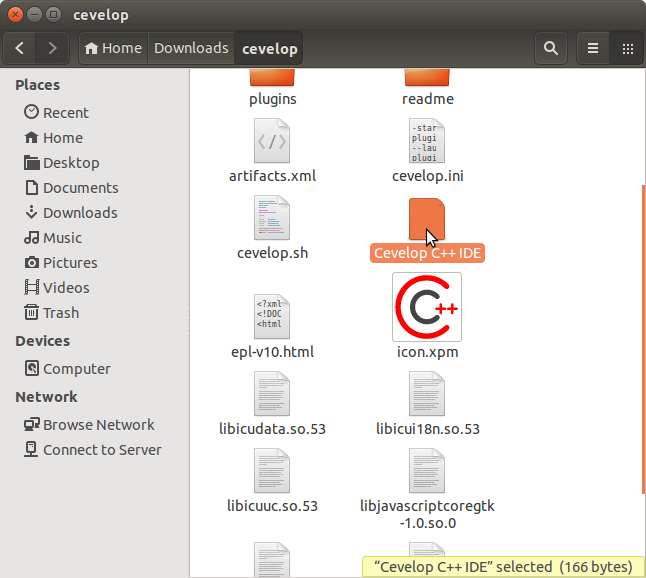

Dosyaları çıkarttıktan sonra cevelop C++ IDE 'sini komut ekranında çalıştırabilirsiniz.

komut satırına aşağıdaki kodu ekleyiniz.

----
./cevelop.sh
----

GCC 7.1 derleyicisini IDE otomatik olarak algıladığından kütüphaneleri eklenmiş şekilde gelecektir.

**Yeni proje oluşturma için**

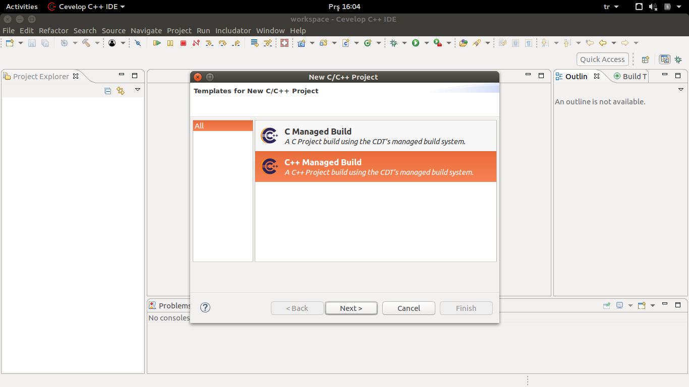

Resimdeki gibi C/C++ projesini seçerek yeni proje oluşturabilirsiniz.

Sonrasında derlemek için aşağıdaki seçenkelerden ilerleyiniz.

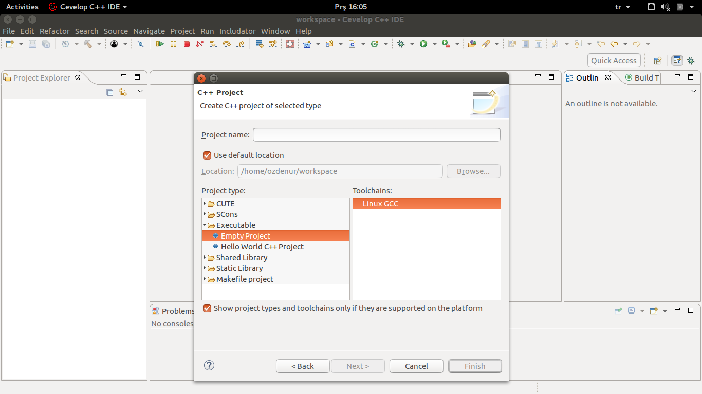

image::linux-4.png[]

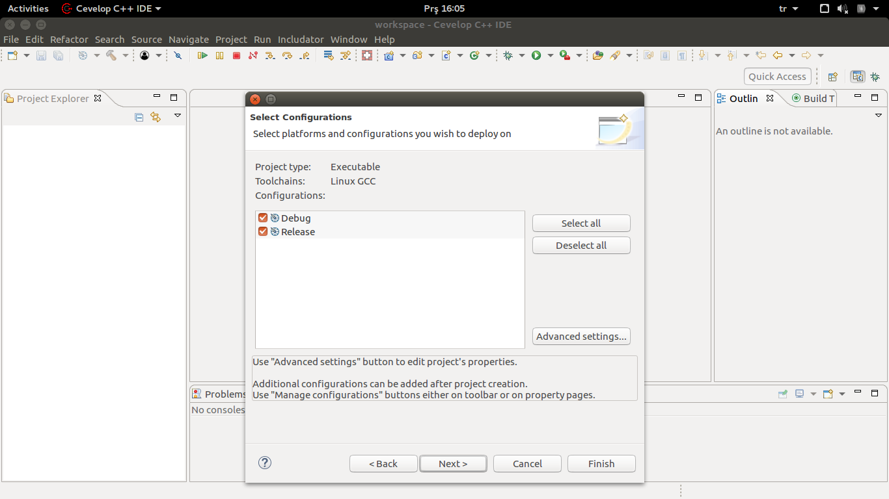

Aşağıdaki gibi proje ismini girerek ilerleyebilirisiniz.

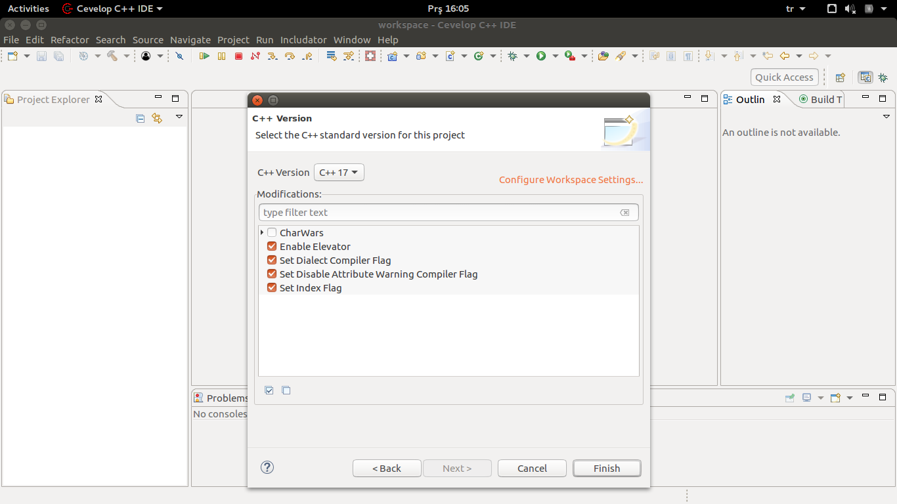

Aşağıdaki gibi proje ismini girerek ilerleyebilirsiniz.

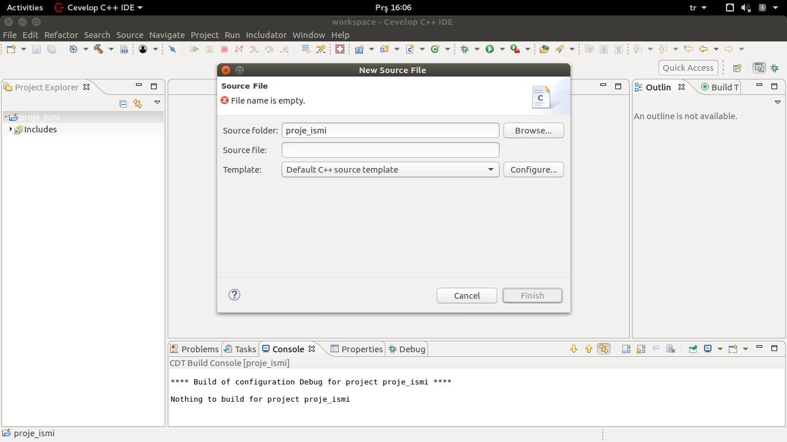

